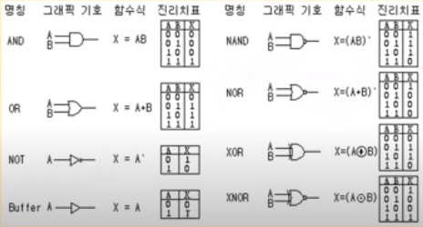
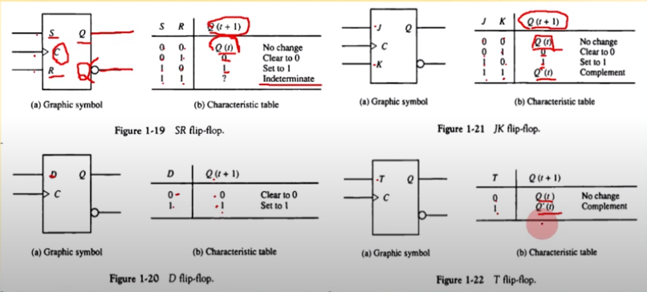

영상: [CSA2021 컴퓨터시스템구조](https://www.youtube.com/playlist?list=PLc8fQ-m7b1hCHTT7VH2oo0Ng7Et096dYc)

## 강의 소개
- 

## [제 1장 Part-1](https://www.youtube.com/watch?v=SG89LOgT7Vc&list=PLc8fQ-m7b1hCHTT7VH2oo0Ng7Et096dYc&index=2)

### 디지털 컴퓨터(Digitial Computer)

- 정의
    - 이진 시스템을 사용하여 계산을 수행하는 디지털 시스템
    - 비트의 그룹을 사용하여 숫자, 문자 및 기타 정보를 표시하거나 처리

- 컴퓨터 하드웨어

    - CPU : 중앙처리장치
        - **컴퓨터 그 자체로 정의**
        - 제어 기능 수행
    - 주변 장치 : 메모리(RAM/ROM), 저장장치(Storage), 입출력장치(IO device)

- 컴퓨터 소프트웨어
    - 운영체제, OS, Operation System
    - 시스템 프로그램
        - 유틸리티, 데이터베이스, editor
        - OS에 포함되거나 연결되어 시스템 운영을 보조
    - 응용 프로그램

<br>

### 논리 게이트(Logic Gates)

]

**이진 정보의 표시**

- 0과 1의 전압 신호
- 0V - 5V 시스템
- 0.5V - 3V 시스템

**논리 게이트**

- 기본 게이트
- 진리표로 동작 정의

<br>


### [부울 대수(Boolean Algebra)](/이산-수학/명제,추론,귀납,부울대수/부울-대수.md)

- 이진변수와 논리 동작을 취급하는 대수
- 기본 대수 동작 : AND, OR, NOT

<br>

**부울 대수를 사용하는 이유**

- 변수 사이의 진리표 관계를 대수적으로 표시함
- 논리도의 입출력 관계를 대수 형식으로 표시
- 같은 기능을 가진 회로를 더 간단한 회로로 발견

**부울 대수의 기본 관계**

- 항등원
- 역원
- 교환법칙
- 결합법칙
- 드모르강의 법칙

<br>

### 맵의 간소화 (Karnaugh Map)
- [4강 동치 관계](/이산-수학/이산수학-기초/동치-관계.md)

1. 부을 함수를 visual diagram을 통하여 간소화
2. Karnaugh map, Veitch diagram
3. Minterm, MaxTerm을 이용한 간소화
4. 논리합의 논리곱
5. 무정의 조건
<br>


## [제 1장 Part-2](https://www.youtube.com/watch?v=gn5z3Un_qqM&list=PLc8fQ-m7b1hCHTT7VH2oo0Ng7Et096dYc&index=3)

### 조합회로 (Combinational Circuit)

**1. 정의**

- 입력과 출력을 가진 논리 게이트 집합
- 출력의 값은 입력의 0, 1의 조합에 의하여 결정되는 함수의 결과로 표시
- n개의 입력 조합이 있을 경우 가능한 입력 조합 : 2<sup>n

<br>

**2. 조합 회로의 설계 절차**
```
1. 해결할 문제의 제시
2. 입력과 출력의 변수에 문자 기호 부여
3. 입력-출력 관계를정의하는 진리표 도출
4. 부울 함수에 대한 논리도 작성
5. 논리도를 바탕으로 회로 구현
```
<br>

**3. 반가산기(half adder)**

- 2 개의 비트 값을 산술적으로 가산

**4. 전가산기(Full adder)**

- 캐리 값을 포함하여 3비트 가산
- 반가산기 두개를 합쳐서 구현할 수 있음


### 플립플롭 (Flip-Flop)

**1. 플립플롭의 정의**

- 1 비트의 디지털 정보를 저장하는 이진 셀(디지털 메모리)
- 다음 입력의 상태가 변화를 일으키기 전까지 이전의 출력 상태를 유지하는 회로
- 동기식 순차회로의 기본적인 요소
- 조합회로와 함께 순차회로를 구성하는데 사용됨
- 마치 상태를 기억하고 있는 것과 같이 동작하기 때문에 메모리 소자로 사용함

**2. 플립플롭의 종류**

- SR-플립플롭
- D-플립플롭
- JK-플립플롭
- T-플립플롭



모서리-변이형 플립플롭(Edge-triggered FF)

- 클럭에서 입력값의 변화 모서리에서만 동작
    - Upward triggered FF
        - 입력값이 상향일 경우에만 동작(0 -> 1)
    - DownWard triggered FF
        - 입력값이 하향일 경우에만 동작(1 -> 0)

- 올바른 동작을 위해서 **최소의 신호 유지 시간**이 필요함
    - **setup time**
        - 출력변화를 위하여 입력이 유지되어야 하는 최소 시간
    - **hold time**
        - 출력 유지를 위하여 입력이 바뀌지 않아야 하는 최소 시간

### 순차회로 (Sequential Circuit)

**정의**

- 플립플롭과 게이트(또는 조합회로)를 서로 연결한 회로
- 클럽펄스에 의하여 동기화된 **입력 순차에 의하여 제어**
- 출력은 외부 입력과 플립플롭의 현 상태의 함수로 표시


<br>

**플립플롭의 입력식**

- FF의 입력을 만들어내는 조합회로 부분
- 부울 수식에 의하여 표현
- 상태표(State Table)
- 상태도(State Diagram)


**순차 회로의 설계 예**

- 2비트 2진 카운터의 설계
    1. 상태표, 상태도 작성
    2. 순차회로 여기표 작성
    3. 플립플롭의 선택과 입력식 도출
    4. 회로도 구현


